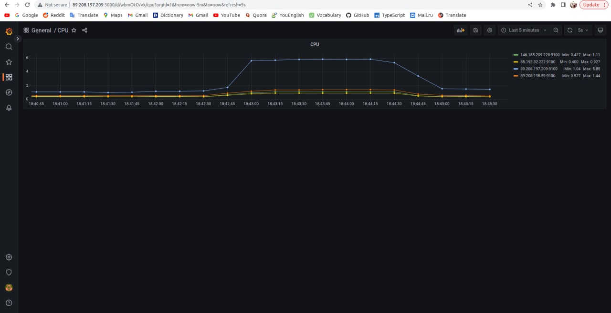
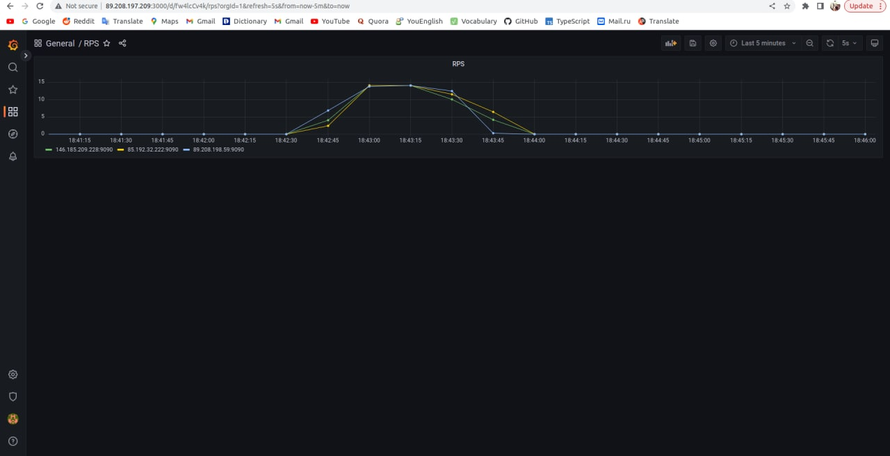
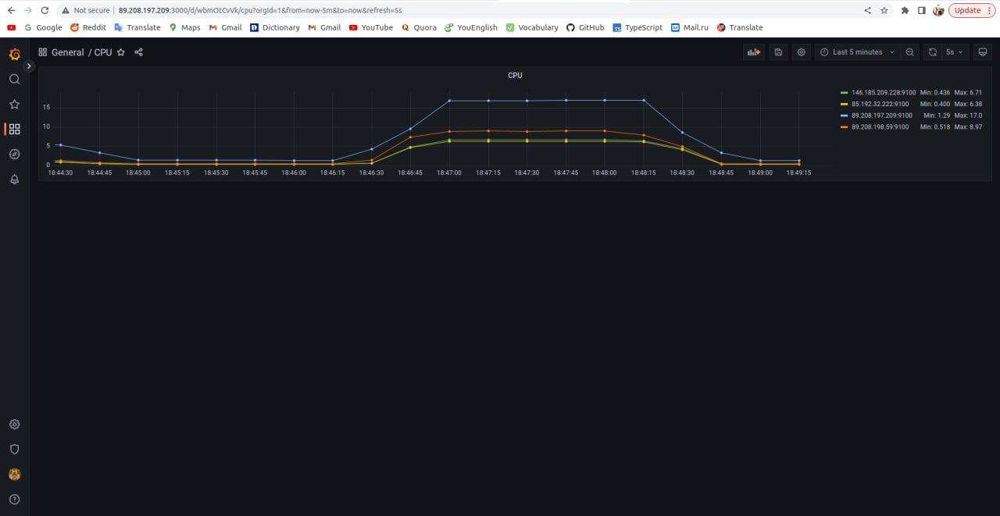
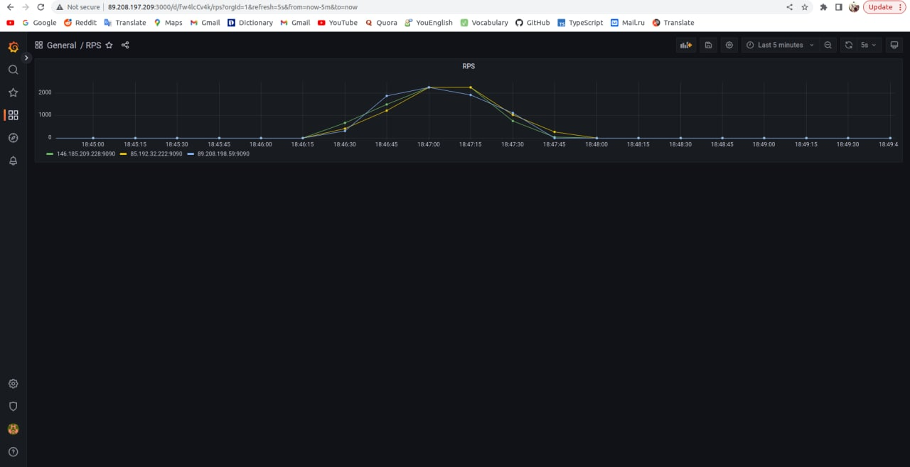
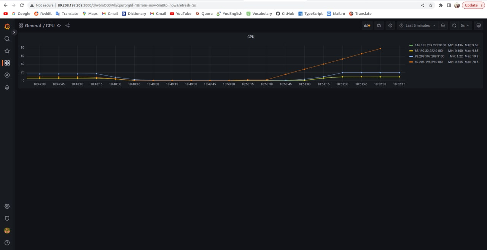
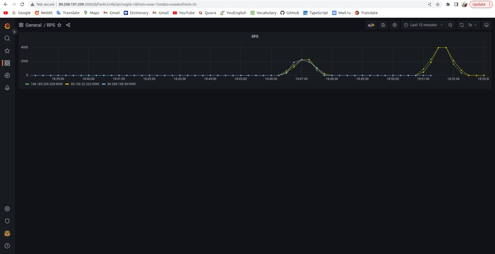

# Репозиторий, позволяющий провести балансировку нагрузки при помощи MCS, Golang форум, L7, haproxy, Graphana + Prometheus

1. Заходим на любой хостинг, по типу MCS, Yandex.Cloud или  VScale, арендуем там 4 виртуальных машины.

    Зачем: на одной машине будет располагаться Prometheus + Grafana + PostgreSQL, на 3-х других - сервера бэкенда, балансировка между которыми и будет проводиться.

    Не забываем поместить их и свой компьютер в одну сеть, можно для этого установить firewall

2. Заходим на первый сервер с IP <your-main-server-ip>. На нём:
    ```
    git clone https://github.com/kalashkovpaul/vk-highload-balancer
    cd vk-highload-balancer
    ```
    Далее при помощи редактора по типу vim / nano меняем следующие файлы: main.go - 28 строка, заменяем <your-main-server-ip> на свой, ./prometheus/prometheus.yml - меняем IP на свои, сохраняем всё это. Далее

    ```
    chmod +x install_docker.sh
    sudo ./install_docker.sh
    cd prometheus
    sudo docker-compose build --no-cache
    sudo docker-compose up -d
    ```

    Дальше скачиваем балансер - в данном случае будет haproxy, но можно и через nginx, см конфиг ниже
    ```
    sudo apt install haproxy
    ```
    Проверяем, что всё норм
    ```
    haproxy -v
    ```
    Дальше закидываем конфиг, можно старый удалить и сразу послать новый:
    ```
    sudo nano /etc/haproxy/haproxy.cfg
    ```
    Конфиг (ip надо обязательно заменить):
    ```
    global
            log /dev/log    local0
            log /dev/log    local1 notice
            chroot /var/lib/haproxy
            stats socket /run/haproxy/admin.sock mode 660 level admin expose-fd listeners
            stats timeout 30s
            user haproxy
            group haproxy
            daemon

            # Default SSL material locations
            ca-base /etc/ssl/certs
            crt-base /etc/ssl/private

            # See: https://ssl-config.mozilla.org/#server=haproxy&server-version=2.0.3&config=intermediate
            ssl-default-bind-ciphers ECDHE-ECDSA-AES128-GCM-SHA256:ECDHE-RSA-AES128-GCM-SHA256:ECDHE-ECDSA-AES256-GCM-SHA384:ECDHE-RSA-AES256-G>
            ssl-default-bind-ciphersuites TLS_AES_128_GCM_SHA256:TLS_AES_256_GCM_SHA384:TLS_CHACHA20_POLY1305_SHA256
            ssl-default-bind-options ssl-min-ver TLSv1.2 no-tls-tickets

    defaults
            mode http
            timeout client 1s
            timeout server 1s
            timeout connect 5s
            timeout http-request 10s
            retries 3
            option redispatch
    frontend http-frontend
            mode http
            bind *:80
            default_backend http-backend
    backend http-backend
            mode http
            balance roundrobin
                    server ubuntu-1 <server-1-ip>:80 check
                    server ubuntu-2 <server-2-ip>:80 check
                    server ubuntu-3 <server-3-ip>:80 check
    ```
    Проверяем, что конфиг нормальный
    ```
    haproxy -c -f /etc/haproxy/haproxy.cfg
    ```
    И запускаем:
    ```
    sudo systemctl restart haproxy.service
    ```
    Успех, эту виртуалку больше не трогаем, идём к следующей.

    P.S. Для тех, кто всё-таки хочет nginx (у него балансировка лучше получается, harpoxy немного отсталый вариант), вот конфиг:
    ```
    events {
        worker_connections 2048;
    }

    http {

        upstream backend {
            server IP1 max_fails=2 fail_timeout=10s;
            server IP2 max_fails=2 fail_timeout=10s;
            server IP3 max_fails=2 fail_timeout=10s;
        }

        server {
            listen 80;

            location / {

                proxy_connect_timeout 50ms;
                proxy_send_timeout 100ms;
                proxy_read_timeout 487ms;

                proxy_next_upstream error timeout http_403 http_404;
                proxy_next_upstream_tries 2;
                proxy_next_upstream_timeout 1s;

                proxy_set_header Host $host;
                proxy_set_header X-Real-IP $remote_addr;
                proxy_pass  http://backend/;
            }
        }
    }
    ```
3. Следующие действия повторить для каждой из оставшихся виртуалок (на которых бэк):
    ```
    git clone https://github.com/kalashkovpaul/vk-highload-balancer
    cd vk-highload-balancer
    chmod +x install_docker.sh
    sudo ./install_docker.sh
    ```
    Далее при помощи редактора по типу vim / nano меняем main.go - 28 строка, заменяем <your-main-server-ip> на свой. После этого:

    ```
    sudo docker-compose build --no-cache
    sudo docker-compose up -d
    ```
5. Заходим на <your-main-server-ip>:3000 - там должна быть Grafana - логинимся через admin, admin и идём создавать дэшборды.
   В созданном дэшборде в панели вставляем через JSON (Dashboard settings / JSON Model - поле panels) в один дэшборд содержимое файла rps.json, в другой дэшборд содержимое cpu.json - и не забываем поменять на свой uid (гугл в помощь. Если соооовсем плохо, можно попробовать без всех этих виртуалок провернуть такую штуку по [данному](https://eax.me/prometheus-and-grafana/) гайду - там есть ссылка на другой json, который можно импортнуть посредством <yourmain-server-ip>:3000/dashboard/import)

   Успех, у нас теперь есть графики CPU и FPS на все наши виртуалки - там уже должны быть графики

6. Дело за малым - потестить балансировку. Можно заполнить бд и провести крутое функциональное и нагрузочное тестирование - для этого см. репозитории по типу [такого](https://github.com/mailcourses/technopark-dbms-forum)

    Для совсем ленивых можно просто тестить через wrk, по типу
    ```
    wrk -t12 -c400 -d30s 'http://<your-main-server-ip>:80/api'
    ```
    Но стоит понимать, что, по сути, это просто пинг. Как-то так, вот примерные скрины получившегося:

    Функциональное тестирование:
    
    

    Нагрузочное тестирование, 3 виртуалки:
    
    

    Нагрузочное тестирование, 2 виртуалки в момент отключения третьей:
    
    

Удачи всем, кто мучается, при большой нужде пишите в лс, может помогу...)
